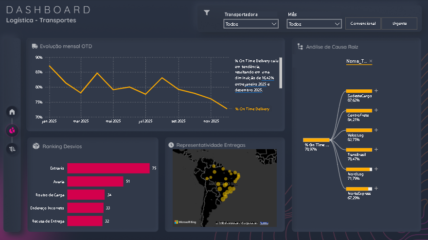

# 📦 Logistics Dashboard | Power BI

Projeto desenvolvido para análise de indicadores logísticos utilizando Power BI, com foco na criação de dashboards que auxiliam o acompanhamento operacional e apoiam a tomada de decisão.

## 🎯 Objetivo

Transformar dados operacionais em informações estratégicas por meio de visualizações interativas, permitindo identificar tendências, monitorar indicadores e apoiar a gestão logística.

---

## 🛠 Tecnologias Utilizadas

- Power BI
- Power Query
- Modelagem de Dados
- DAX
- Excel

---

## 📊 Indicadores Analisados

- Total de Entregas
- Pedidos por Transportadora
- Entregas por Estado
- Tempo Médio de Entrega
- Status dos Pedidos
- Indicadores Operacionais

---

## 📈 Principais Resultados

- Construção de dashboard interativo para acompanhamento logístico.
- Organização e transformação dos dados para análise.
- Desenvolvimento de visualizações voltadas à tomada de decisão.
- Aplicação de boas práticas de modelagem e visualização de dados.

---

## 📸 Dashboard

> Adicione aqui uma imagem do dashboard.

## 🚀 Objetivo do Projeto

Este projeto foi desenvolvido como prática de Business Intelligence e Visualização de Dados, simulando um cenário real de análise logística utilizando Power BI.
